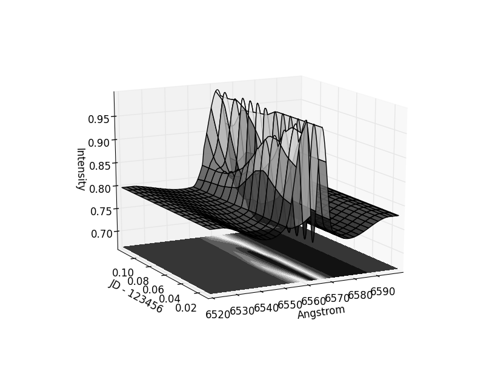

`dynaspec` is a simple tool for showing time series of astronomical spectra
in a 2 dimensional plot.

Spectra must be in FITS format with `NAXIS = 1`, and must contain the following
headers as a minimum:

    CRVAL1
    CRPIX1
    CDELT1
    JD-MID

Requirements
------------
`dynaspec` requires Python, with the following modules - `pyfits`, `numpy`,
`matplotlib` and `scipy`.

Usage
-----
The directory `example` contains some simulated dynamic spectra:

Given these spectra as input, the following plots were generated:

    # Plot dynamic spectra with defaults
    ./dynaspec example/*.fit

    # Plot with velocity scale against 6563 Angstrom with a custom colormap
    ./dynaspec --velocity 6563 --cmap afmhot example/*.fit

A script for plotting 3d time series is also provided:

    # Plot 3d with defaults
    ./dynaspec_3d example/*.fit

    # Plot 3d without contour map and with custom colormap
    ./dynaspec_3d --nocontour --cmap gist_stern example/*.fit
